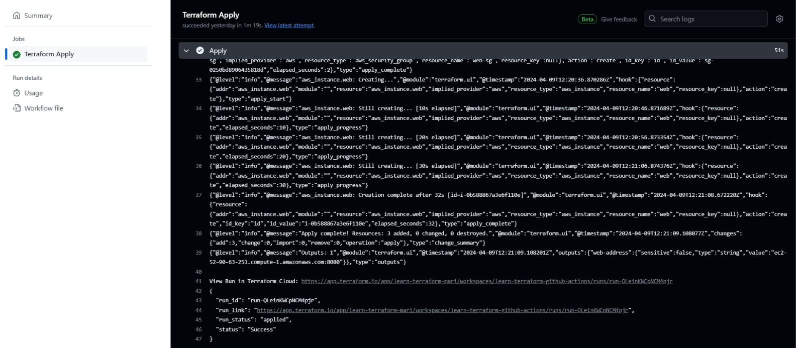
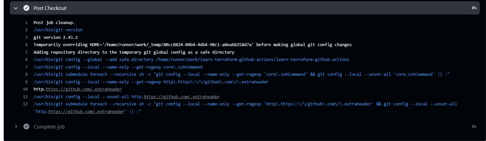
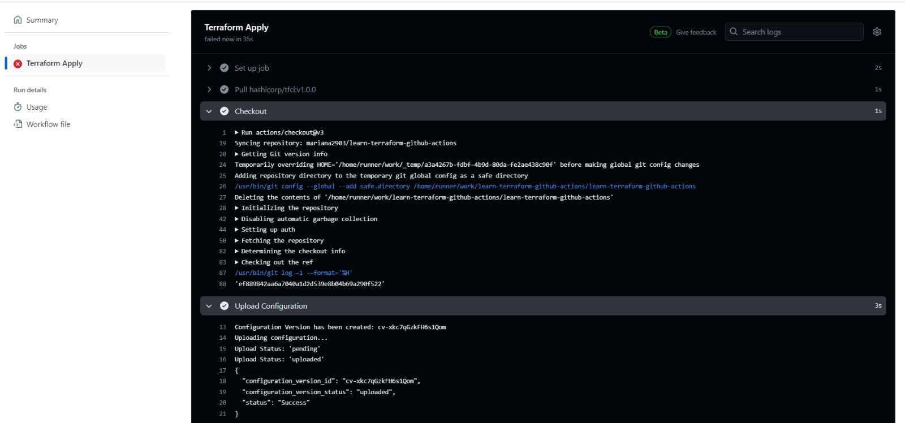
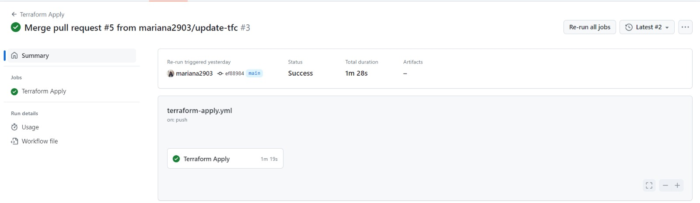
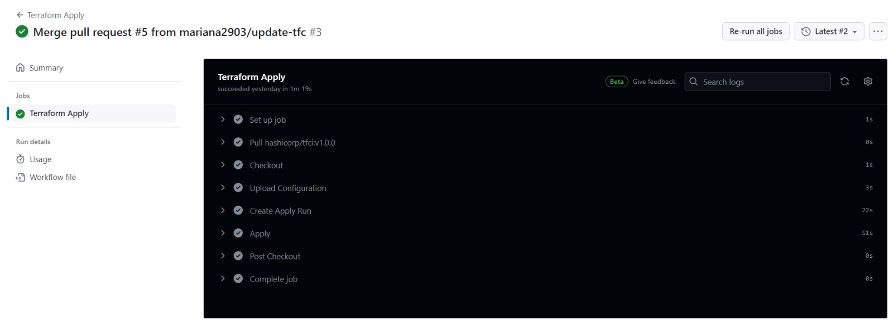
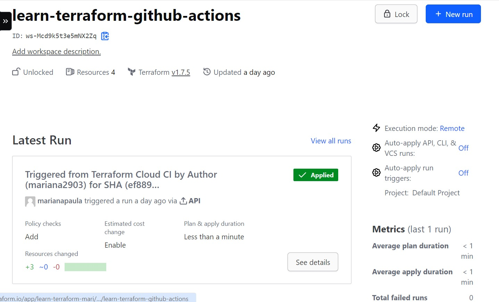

# Automate Terraform with GitHub Actions

This repo is a companion repo to the [Automate Terraform with GitHub Actions tutorial](https://developer.hashicorp.com/terraform/tutorials/automation/github-actions).

## Imagens do Terraform em funcionamemto 

</img>

</img>

</img>

</img>

</img>

</img>
